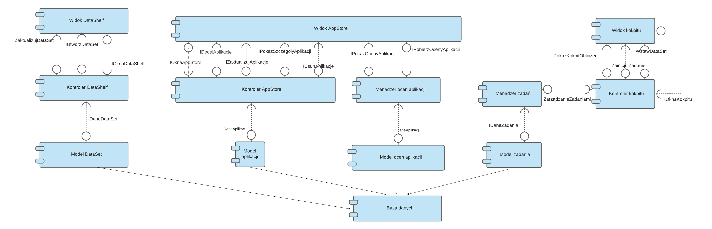
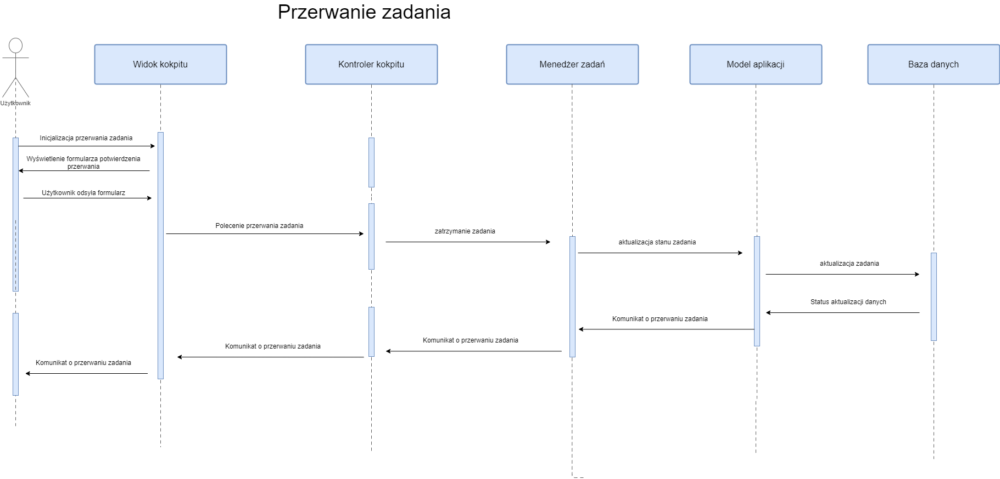
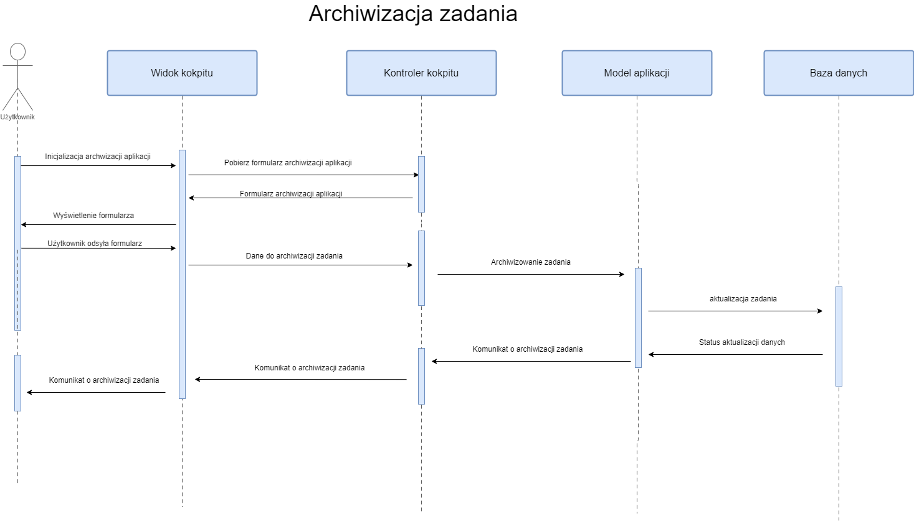
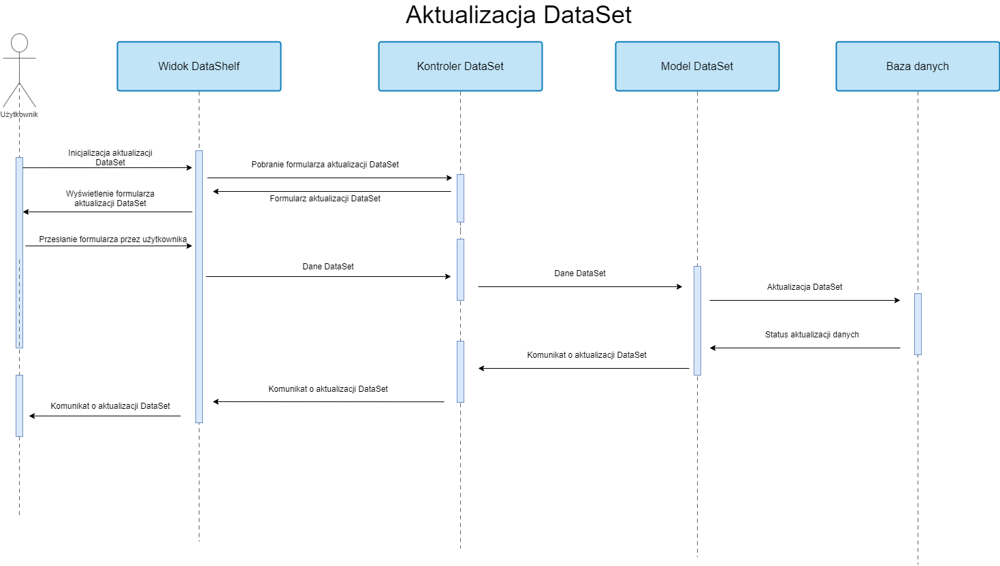

# System obliczeń wysokoskalowych

## Diagram komponentów

## Diagramy sekwencji

### AppStore

##### Dodawanie aplikacji do AppStore

##### Aktualizacja aplikacji w AppStore

##### Usuwanie aplikacji z AppStore

##### Dodanie oceny aplikacji

##### Wyświetlenie szczegółów aplikacji w AppStore

### Kokpit obliczeniowy

##### Inicjalizacja zadania obliczeniowego

##### Inicjalizacja zadania na bazie zakończonego zadania

##### Przerwanie zadania

##### Wyświetlenie szczegółów zadania

##### Archiwizacja zadania

### DataShelf

##### Utworzenie DataSet

##### Aktualizacja DataSet

